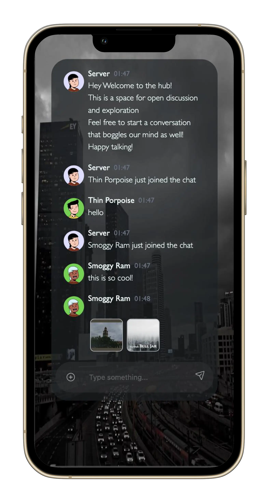

# Bell Jar

Hey there! This is _my kinda Bell Jar_, my real-time chat server.

I built this to explore WebSockets and create a spot super easy to access from any browser, any device, with hidden identities, and nothing else needed. Plus, I love Sylvia Plath, hence the name, cuz bell jar smh rhymed with socket(_not literally_). 


## What It Does

* uses WebSockets to create a permanent connection between your browser and the server, zipping messages back and forth in real-time
* responsive design across all devices
* users get unique names and cool avatars
* send files (up to 5MB) with preview and download options


###

This project kicked off last year as a basic HTML, CSS, and JavaScript site, mainly for laptops. This year, I rebuilt the whole thing from the ground up using React.js and Tailwind CSS for a responsive ui with a few more features.

#### Version 0.0 (checkout the branch wsv1)


#### Version 1.0 

<!--  -->
<table>
  <tr>
    <td>
      
      <br/>
      
    </td>
    <td>
      
    </td>
  </tr>
</table>


## Tech Stack

* **Frontend:** React.js, Tailwind CSS, react useWebSocket
* **Backend:** Node.js, ws(a nodejs websocket library)

 used [bandname](https://github.com/Prismatik/bandname) to generate really cool names, [nanoid](https://www.npmjs.com/package/nanoid) to generate unique IDs and [react-nice-avatars](https://www.npmjs.com/package/react-nice-avatar) to generate cool avatars for users.


## Quick Start

```bash
# Clone the repository
git clone https://github.com/anjelica0224/websocket.git
cd websocket

# Install dependencies
npm install

# Start the server
npm start

# Open another terminal window and navigate to client directory
cd client
npm run dev